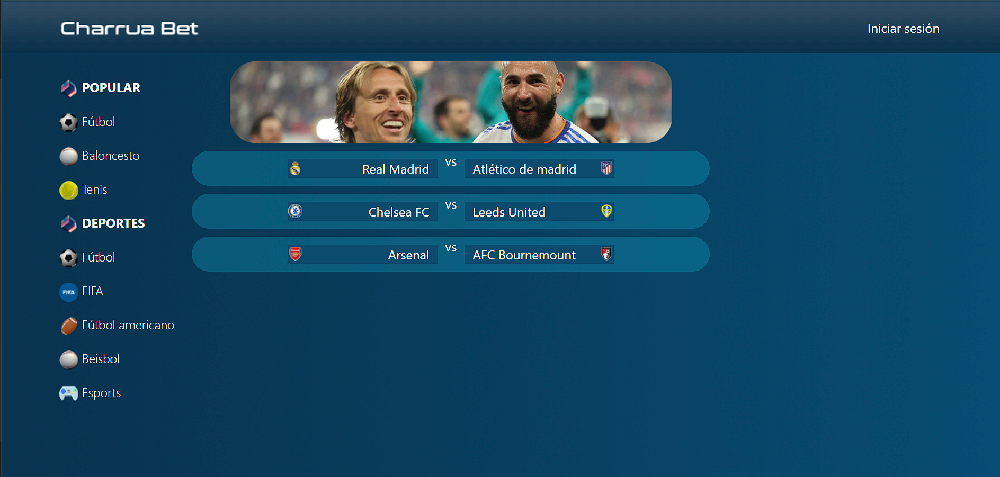

<a name="top"></a>

<h1 align="center">
  <br> Charrua Bet Frontend
</h1>

---

- [About](#about)

- [Instructions](#instructions)

- [Screenshots](#images)

- [Tools](#tools)

---

<a name="about"></a>

## About :speech_balloon:

This project is the frontend of a sports betting website, developed with modern web technologies. Our goal is to provide users with an intuitive and thrilling experience for placing bets on their chosen sports events.

<a name="instructions"></a>

## Instructions 📝

The first step is to clone the repository and install the project dependencies.

### `npm i`

Run the server.

### `npm run dev`

<br>

On the other side, you will need to clone the backend from [this repository](https://github.com/fran1893/charrua_bet_backend) and follow its instructions to run it.

<a name="images"></a>

## Screenshots 📸

Home (not signed in)



Login


Admin page.


Home page and bet (player)


Bet history page (player)


<a name="tools"></a>

## Stack 🔧

<div align="center">
<a href="https://es.react.dev/">
    
</a>
<a href="https://react-bootstrap.netlify.app/">
    
</a>
<a href="https://sass-lang.com/">
    
</a>
<a href="https://developer.mozilla.org/es/docs/Web/JavaScript">
    
</a>
<a href="https://nodejs.org/es">
    
</a>
 </div>

## Contribuciones

Las sugerencias y aportaciones son siempre bienvenidas.

Puedes hacerlo de dos maneras:

1. Abriendo una issue
2. Crea un fork del repositorio
   - Crea una nueva rama
     ```
     $ git checkout -b feature/nombreUsuario-mejora
     ```
   - Haz un commit con tus cambios
     ```
     $ git commit -m 'feat: mejora X cosa'
     ```
   - Haz push a la rama
     ```
     $ git push origin feature/nombreUsuario-mejora
     ```
   - Abre una solicitud de Pull Request